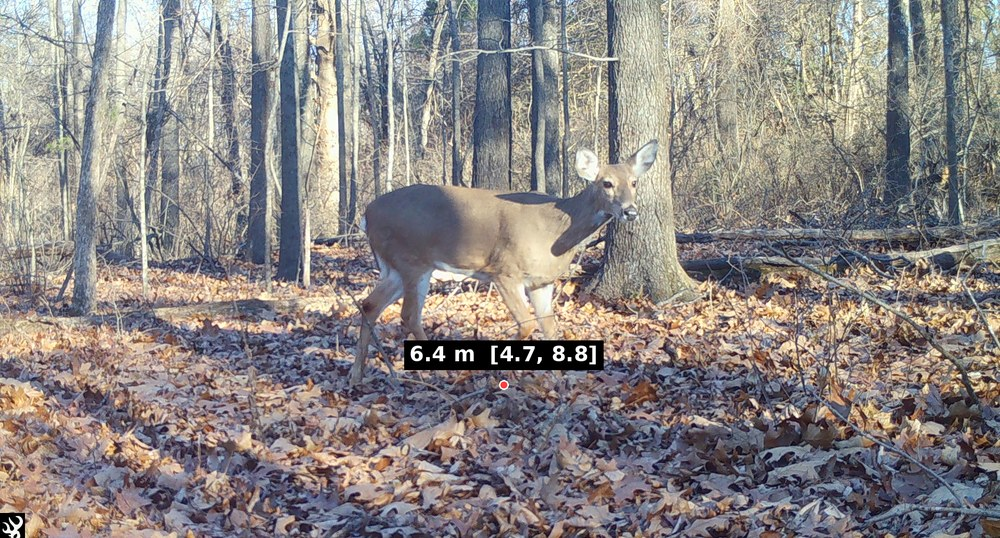
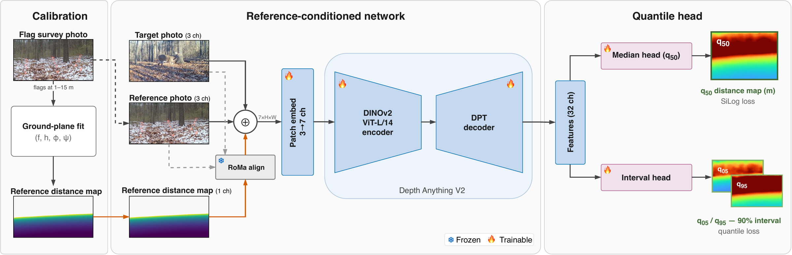
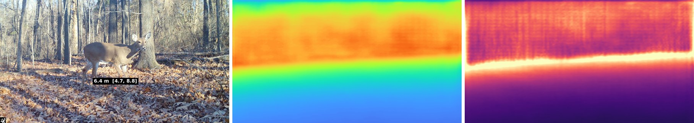

<div align="center">

# Reference-Conditioned Distance Intervals on Unseen Camera Traps

[Toqi Tahamid Sarker](https://orcid.org/0000-0003-2482-8059),
[Taminul Islam](https://orcid.org/0000-0002-7803-4564),
[Seth J. Morelock](https://orcid.org/0009-0003-1657-1895),
[Guillaume Bastille-Rousseau](https://orcid.org/0000-0001-6799-639X),
[Khaled R. Ahmed](https://orcid.org/0000-0002-3707-4316)

Southern Illinois University Carbondale

Computer Vision for Ecology Workshop (CV4E), ECCV 2026

[Paper](#citation) · [Weights](https://huggingface.co/toqi/camtrap-distance) · [Dataset](https://huggingface.co/datasets/toqi/camtrap-distance-flags)



</div>

## Abstract

Ecologists measure how far an animal is from the camera across many wildlife surveys, with distance sampling turning those distances into abundance estimates. Trail cameras have become a standard survey instrument, yet they carry no depth sensor, record no lens intrinsics, and shift aim over their deployment. Prior camera-trap distance methods report a single number with no error estimate. We report each distance with a 90% interval that stays reliable on cameras never seen in training. A one-time flag survey fits a 4-parameter ground-plane model per photo, giving a dense reference distance map. A reference-conditioned Depth Anything V2 network carries that map onto later flag-free photos, predicting horizontal ground distance and a monotone quantile interval in one forward pass. Replacing the survey with image-predicted camera geometry makes distance 11.3 times worse, so the survey is not optional. On a benchmark of 62 cameras across two sites, held-out cameras reach 0.827 m MAE, matching the 0.875 m within-photo geometric limit. Across 53 leave-one-camera-out folds the 90% band covers 95.3% of distances with no per-camera recalibration, and the same weights transfer zero-shot to the public Lindenthal dataset, a different continent, species, and sensor, at 99.3% coverage.

## Overview

<div align="center">

</div>

The method has three parts.

1. **Calibration.** One surveyed flag photo per camera. Flags at known distances fit a 4-parameter ground-plane model (focal length, camera height, pitch, roll), which gives a dense reference distance map $D_R$.
2. **Alignment.** At deployment, the stored reference photo is registered onto the new photo with RoMa and $D_R$ is expressed in the new photo's frame. A registration check flags cameras whose reference no longer matches.
3. **Network.** Depth Anything V2 takes the target photo, the reference photo, and $D_R$ as a 7-channel input and predicts horizontal ground distance with a monotone 90% interval $[q_{05}, q_{50}, q_{95}]$ per pixel.

| directory | contents |
|---|---|
| `src/calibration/` | ground-plane calibrator and annotation quality checks |
| `src/alignment/` | RoMa registration and the registration check |
| `src/network/` | model, training, evaluation, inference |
| `scripts/` | command-line entry points |
| `tests/` | unit tests and the paper's reported numbers |

## Installation

Python 3.11 and a CUDA GPU.

```bash
python -m venv env && source env/bin/activate
pip install torch                                   # build for your CUDA version, see pytorch.org
pip install -r requirements.txt
pip install "git+https://github.com/Parskatt/RoMa"  # romatch
pip install huggingface_hub
```

All commands run from the repository root with `PYTHONPATH=.`.

## Data and weights

| artifact | location | licence |
|---|---|---|
| code | this repository | MIT |
| flag survey (62 cameras, 122 photos, annotations, calibrations) | [`toqi/camtrap-distance-flags`](https://huggingface.co/datasets/toqi/camtrap-distance-flags) | CC BY-NC 4.0, gated |
| trained weights (two seeds) | [`toqi/camtrap-distance`](https://huggingface.co/toqi/camtrap-distance) | CC BY-NC 4.0 |

```bash
PYTHONPATH=. python scripts/fetch_data.py                            # -> data/  (request access, then `hf auth login`)
hf download toqi/camtrap-distance --local-dir outputs/paper-ckpt     # -> outputs/paper-ckpt/seed{1,2}/best
```

`seed1/best` is the checkpoint to use. `seed2/best` is the second training run; the paper's numbers are the mean of the two.

## Inference

A camera is surveyed once. Its flag photo and calibration are stored, and every later photo from that camera is scored against them.

```bash
PYTHONPATH=. python scripts/predict.py \
    --ckpt outputs/paper-ckpt/seed1/best \
    --target new_photo.jpg \
    --ref data/flaglabel-dataset/MAS_CAM04/IMG_0001.JPG \
    --calibration data/calibrations/MAS_CAM04/IMG_0001.json \
    --png pred.png
```

From Python:

```python
from src.calibration.ground_plane import load_calibration
from src.network.model import load_checkpoint
from src.network.predict import predict

model = load_checkpoint("outputs/paper-ckpt/seed1/best")
calibration = load_calibration("MAS_CAM04", "IMG_0001")
p = predict(model, "new_photo.jpg", "data/flaglabel-dataset/MAS_CAM04/IMG_0001.JPG", calibration)
p.q05, p.q50, p.q95      # (H, W) arrays, metres
p.abstain                # True if the reference no longer registers to this photo
```

`--no-align` skips registration and feeds the unaligned reference; this is the paper's ablation, not the method.

## Reproducing the paper

```bash
PYTHONPATH=. python scripts/calibrate.py                    # optional: refit calibrations from the annotations (CPU)
PYTHONPATH=. python src/network/build_targets.py            # reference distance maps          -> outputs/targets_d/
PYTHONPATH=. python src/alignment/build_prompts.py          # RoMa-aligned reference maps (GPU) -> outputs/prompts_roma/
PYTHONPATH=. python src/network/train.py --aligned-ref --seed 1 --out outputs/ckpt       # ~2 h on one GH200
PYTHONPATH=. python src/network/train.py --aligned-ref --seed 2 --out outputs/ckpt_s2
PYTHONPATH=. python src/network/evaluate.py --ckpt outputs/ckpt/best --roma-dir outputs/prompts_roma
```

Training defaults are the paper's: 100 epochs, AdamW (weight decay 0.01), head learning rate 5e-5, encoder learning rate 5e-6 with the encoder frozen for the first 40% of epochs, polynomial decay, batch size 4, bfloat16.

## Results

Held-out test cameras (12 of 62, 801 markers), two-seed average. MAE and p90 in metres; coverage of the 90% interval.

| method | MAE | p90 | coverage |
|---|---|---|---|
| Depth Anything V2, zero-shot | 4.63 | 8.93 | – |
| geometric transport, no network | 0.876 | 2.031 | – |
| within-photo geometric limit | 0.875 | 1.864 | – |
| ours, unaligned reference (ablation) | 1.172 | 2.663 | 94.9% |
| **ours, aligned reference** | **0.827** | **1.817** | **98.0%** |

<div align="center">

</div>

## Citation

```bibtex
@inproceedings{sarker2026reference,
  title     = {Reference-Conditioned Distance Intervals on Unseen Camera Traps},
  author    = {Sarker, Toqi Tahamid and Islam, Taminul and Morelock, Seth J.
               and Bastille-Rousseau, Guillaume and Ahmed, Khaled R.},
  booktitle = {Computer Vision for Ecology Workshop, European Conference on Computer Vision (ECCV)},
  year      = {2026}
}
```

## Licence

Code is released under the MIT licence (see `LICENSE`). The trained weights and the flag survey are CC BY-NC 4.0; the weights derive from Depth-Anything-V2-Large, which is itself CC BY-NC 4.0.

## Acknowledgements

We thank the Illinois Department of Natural Resources and the Federal Aid in Wildlife Restoration Project W-87-R for supporting this work. This work used the DeltaAI system at the National Center for Supercomputing Applications (award OAC 2320345) through allocation CIS260273 from the Advanced Cyberinfrastructure Coordination Ecosystem: Services & Support (ACCESS) program, supported by National Science Foundation grants #2138259, #2138286, #2138307, #2137603, and #2138296.

The network builds on [Depth Anything V2](https://github.com/DepthAnything/Depth-Anything-V2); alignment uses [RoMa](https://github.com/Parskatt/RoMa).
